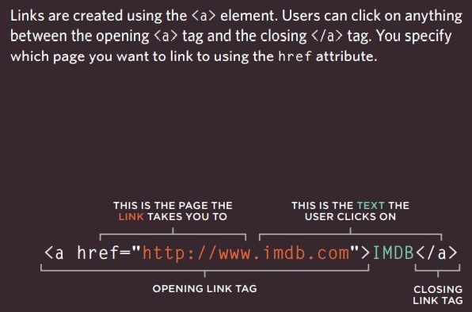
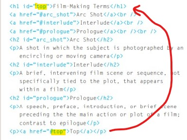

# HTML, links

## We can use links to:
* Linking to Other Sites

you can but the URL of any web page in `href` attribute, then it will send you to it.
* Email Links

you can make the link open the mail program with an e-mail address to send mail to by: `mailto:examples@email.co` in `href` attribute.
* Opening Links in a New Window

To force the link to open in new window use  `target="_blank"` attribute. after the `href`
* Linking to a Specific Part of the Same Page

you can go to specific part in the same page by identifying the part(element) via `id=` attribute, then in the link's `href` put the id forward by #. 

* Linking to Other Pages on the Same Site

If you want to surf pages in the same web site with links, and the files of the pages are in the directory(folder) of the index.html you can just type the name of the file with the .html extension in link's `href` attribute.

If the pages is organized in different folder you have to manage complex stuffs like.

Read p81,82 in *Duckett's HTML&CSS book* to know exactly what you have to do.
# CSS Layout introduction
How to control where each element sits 
on a page and how to create attractive 
page layouts?
* Controlling the position of elements
* Creating site layouts
* Designing for different sized screens

These are the main concepts of layout chapter. We will cover deep details in other reading note soon.

# JavaScript function
**Basic Function**

Function let you group a series of statements together to perform a specific task. then you can call it many times in the script to redo all statement it contain again.

**Declaring function that need information**

If you want to call series of statement but with different inputs or variables you can use `parameter` to define the values at in calling the function.
> function example(`x, y`){
    let CarAcceleration= x/y
}
example(`90, 60`)