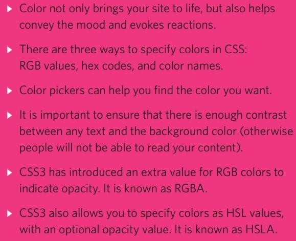
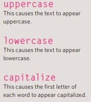
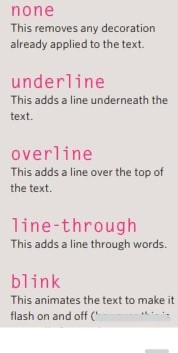
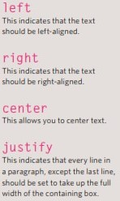
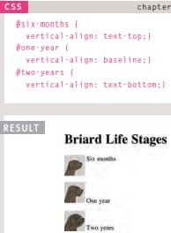
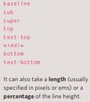
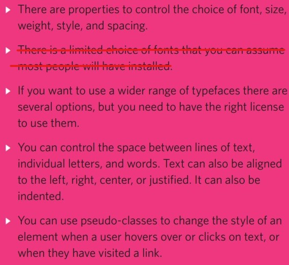

# CSS-HTML Images, color and Text

## Image
**Add images**
1. You can choose images for your web site from online sites, or you can store images in your website, upload it and link it. 
2. `` this is an empty element. It s used to link images to HTML, and it includes attributes:
    * `src` to but the path of the image, or the link of the image.
    * `alt` to add a description to the image. which is readable to screen reader to whom cannot see the web page due to disability or busy in other thing.
    * `title` also you can add title to the image,  some fo web browser display it when you hover on th image.
3. you can style the images by CSS sheet; to adjust height & width, shadows, position and etc.

**Three Rules for Creating Images** 
1. Save images in the right format
   * You can use `PNG` for logos, image with transparency or images that has few colors or large areas of the same color
   * `GIF` for animated images 
   * `JPEG` for colorful images and photographs.
2. Save images at the right size
    * you should save images in the same size that would appear on the web page. to avoid damaging the shape of the it. 
3. Use the correct resolution
    * If  yoy have many images on the same page you mast use 72ppi (pixel per inch) images to avoid lag. The images that are larger than necessary take longer time to download.
## Color
    
* `RGB` (red, green, blue) values 
* `color names` red, brown, aqua, blue, ...  
* `hex codes` #0000 = black, #f1f1f1 = white ...
* `rgba` (red, green, blue, opacity)
* `hsl, hsla` (Hue, Stress, lightness, alpha(transparency) )

## text

* you can use Google fonts web site or other web sites which provides many font styles, to link or import any proper style you want.
    * `@import the URL` to select the font, or link it in the head of the HTML page as it is in the web site. 
    * in CSS sheet you can select paragraph or text to add the font family and style properties.
* **text properties**
    * `text-size` to control the scale of the font (5px. 16px, 18px, 60px,..)
    * `font-weight` (bold, normal, bolder, black,..)
    * `font-style` (italic, normal, oblique,..)
    * `text-transform` 
     >  
    * `text-decoration`
     > 
    * `line-height` to make vertical space between lines.
    * `letter-spacing, word-spacing` to make space between letters or words (H e l l o), (Hello_______dear ).
    * `text-align` 
    >
    * `vertical-align`
    >
    * `text-indent` to take a space in the first line of paragraph.

* **Select text**
    * :first-letter, :first-line
    * :link, :visited
    * :hover, :active, :focus

