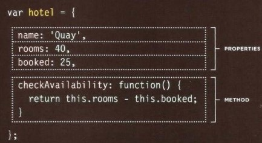
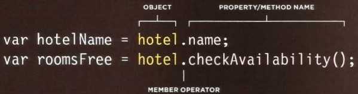
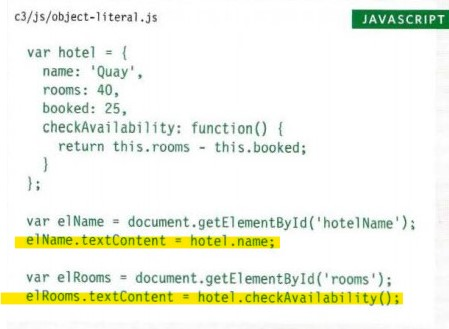
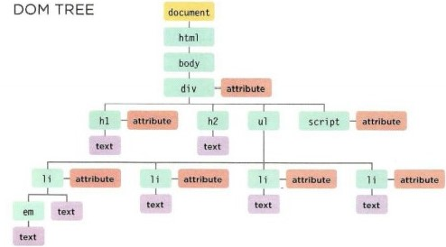
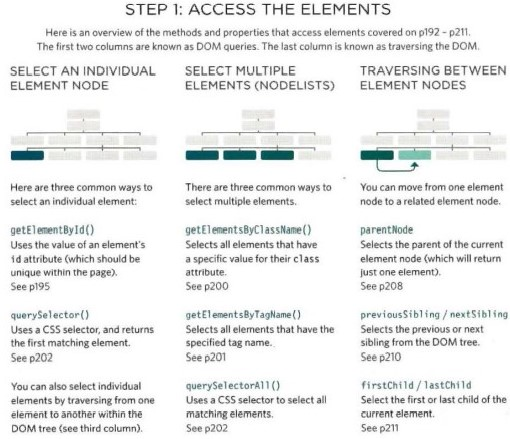
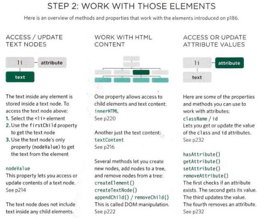

# The proplem domain, Object Literals & Document Object Model.

## The hardeies thing in programming is to understand the proplem domain.
* **Why problem domains are hard?**
when ou start to wright a code you cannot realy see what are you trying to do, you put together code with the purpose of building components that we have taken out of the problem domain.

The issue is that many  problem domains are like a puzzle with a blurry vision or no vision at all.
`The real world is a messy place. Many of the problem domains we face as programmers are difficult to understand and look completely different depending on your viewpoint.`
* **If you under stand the promlem domin the programing and coding part becomes easy.** 

	* What can you do about it?
		* Make the problem domain easier
		* Get better at understanding the problem domain.

* **You can often make the problem domain easier by cutting out cases and narrowing your focus to a particular part of the problem.**

* **Do NOT fall into the trap of thinking you understand enough of the problem to get started coding it.**
	* make sure you understand a problem inside and out before you try and solve it with code.

***

## Object Literals.
The object concests of variables and functions to cread a modle of something you would recognize in the real world.
>like creating a modle of hotel, and the method is to check the valid rooms.
* In an object:
	- variables are the properties. 
	- function are the method.

* To to access the object therre is two ways:
	- Dot notation
	
	- Square brackets
	

**Dot notation example**
 

--- 

## Document Object Model.
The `document.` Object (DOM) Model specifies how browsers should create a model of an HTML page and how JavaScript can access and update the contents of a web page while it is in the browser window. 

* The (DOM) tree is the model of the web page (HTML), which is saved in the memory of the web browser as it load the web page.

	>

* JavaScript can access & change the content of the (HTML) page by select elements then make changes or work on them.

	> 

***

**[Back to: Homepage](https://omarhumamah.github.io/reading-note/).**