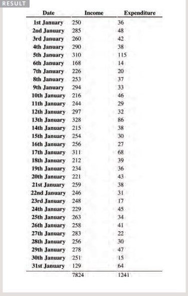

# Domain Modeling & HTML Tables
***
## Domain Modeling
`Domain modeling` is the process of creating a conceptual model for a specific problem. And a domain model that's articulated well can verify and validate your understanding of that problem.

* **Tips to follow when building your own domain models.**

    1. When modeling a single entity that'll have many instances, build self-contained objects with the same attributes and behaviors.
    2. Model its attributes with a constructor function that defines and initializes properties.
    3. Model its behaviors with small methods that focus on doing one job well.
    4. Create instances using the new keyword followed by a call to a constructor function.
    5. Store the newly created object in a variable so you can access its properties and methods from outside.
    6. Use the this variable within methods so you can access the object's properties and methods from inside.
***
## HTML Tables
* **How to create a table?**

**basic table**
1. `<table>`
The `<table>` element is used 
to create a table. The contents 
of the table are written out row 
by row.
2. `<tr>` to contain items in row
3. `<td>` to write items
4. `<th>` to write heading for row and column
    * attribute `scope= 'row/col'`

**Spanning Columns**

* `rowspan='2'` to make item use more than one row

**Long Tables**
1. `<thead>`The headings of the table should sit inside the `<thead>` element. 
2. `<tbody>`The body should sit inside the `<tbody>` element. 
3. `<tfoot>`The footer belongs inside the 
`<tfoot>` element.

**[Back to: Homepage](https://omarhumamah.github.io/reading-note/).**