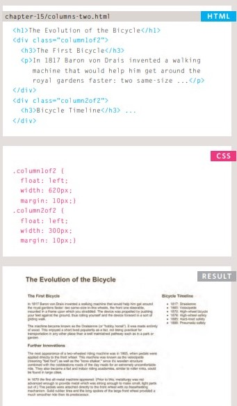
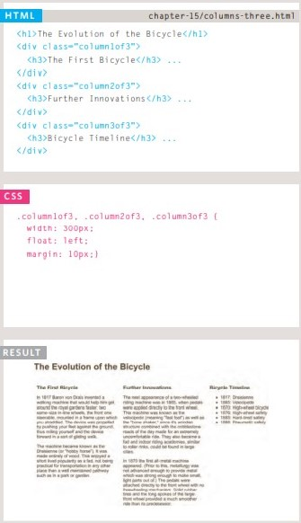
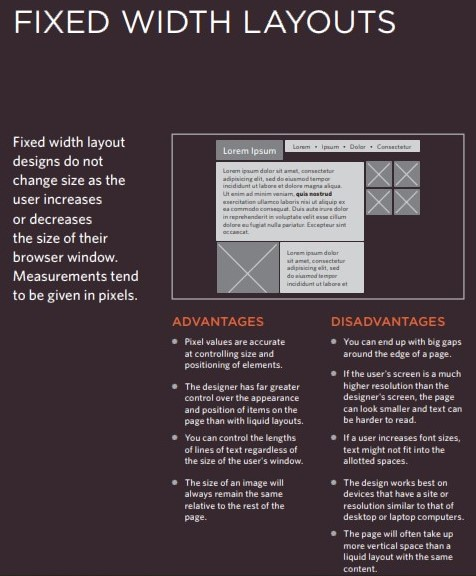
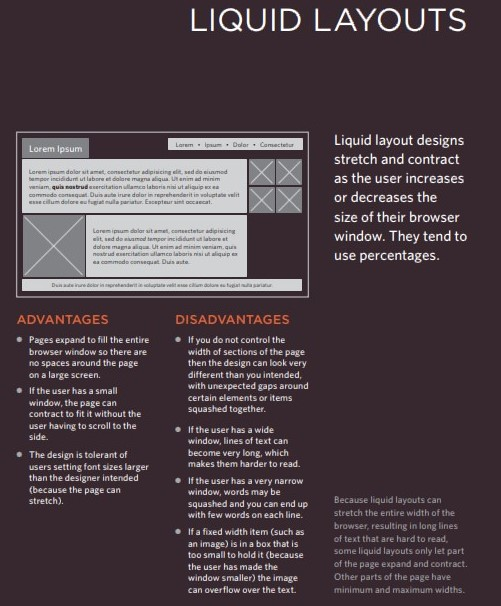
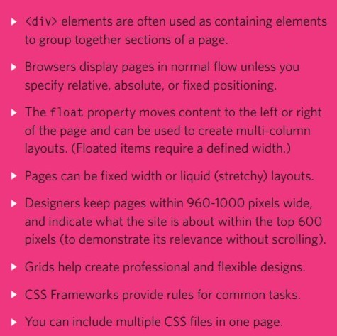

# css layout
* Controlling the position of elements
    * there is some elements displayed bloke`<h1> 
 <ul> <li>` and some elements displayed inline ` <b> <i>.`
    * you can control the flow of elements by positions schemes: Normal flow, Relative Positioning, Absolute positioning, Fixed Positioning, Floating Elements.
    * you can create column in simple why using float properties.

    

* Creating site layouts & Designing for different sized screens.
    * due to multiple screen you you want to display your sit on, the elements could be fixable to the screen resoluton, in other word the position might change by the the desktop, laptop or phone screen resolution. 
    * but you can make it fixed to avoid any change, liquid to be flexible

    

**you can link multibe CSS sheets to your HTML pages or Import styles by URL to modifiy your page more and more**

**more details tou can fine in *HTML & CSS
Design and Build Websites
Jon Ducket Book* page 58**

