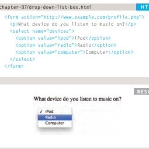

# Forms  & Events
## forms
**Why we use forms?**
We use forms to collect data from the user, then we can use this data to make the web page interact with the user.
* `<label>` element is to but name the form input element 
* `<input>` element is to to make a field that the user can fill with his/her information.

**There is many types of inputs**

1. `text` to one line text "the value is always string"
2. `<textarea>` it is an element to create space to user type a paragraph.
    
3. `password` to type password like *******
4. `radio`  to make the user pike on choice inside the form 
5. `checkbox` to make a checkbox
6. `<select>` & `<option>` to make an option list
    
7. `number` accept only number
8. `submit` to make submit button 

And there are more intresting types you can check in *Ducket HTML & CSS book p145*

***
# Event
**Why do we need event?**
events is like a function but it called when the user make something. like click on a link or text, click on image or submit a form.

**the syntax of event**
for the syntax you need to re-read from *Ducket's JS book p250*

**[Back to: Homepage](https://omarhumamah.github.io/reading-note/).**