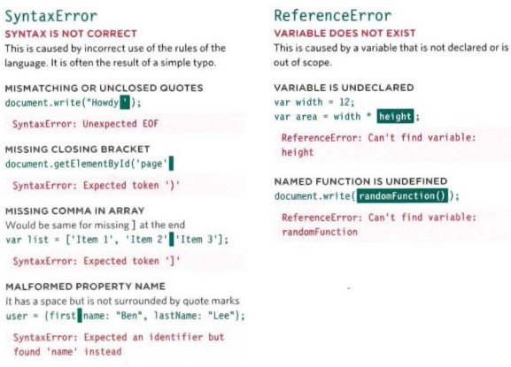
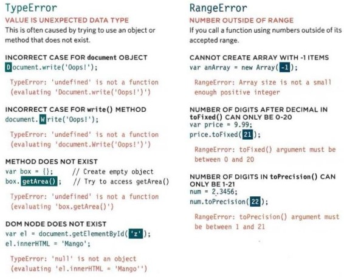

# Error Handling & Debugging

When you write a code in JavaScript you may not write it right from the first time. so there is a kind of messaging from the browser to tell you what is wrong with your code and in which line.

**In order to check such messages**
you can open yh project in your browser. then right click in the page > inspect, or control+shift+i.
then from the window that appears go to the consol
 
**What should you do if you face any error in you code?**
1. Debug your code; check the script line by line, go to the line which had the problem and check if there any thing missing regarding to scope, variables or syntax.

    consol.log(data); to consol to see what the result of the code.

2. Handle errors gracefully; use TRY, CATCH, FINALLY statements in your code.

***

**[Back to: Homepage](https://omarhumamah.github.io/reading-note/).**