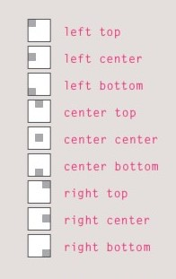

# CSS images & audio and video
## CSS images
* you can modify images in CSS with many properties, and you can add background images with different styles.

	* `width` % `hight` to control the size of the image.
	* you can use `float` with images to inline it with a text or move it left or right.
	* with `margin : 0px auto` you can center an image in the middle of the page.
 * **you can add background to the page by selecting the body element or you can add it to specific element by `background-image: url();`**
	* `background-repeat: repeat` to repeat the image in both horizontally and vertically / `repeat-x` horizontally / `repeat-y`vertically.
	* `background-attachment: fixed` the image will stay at the same position while scrolling / `scroll` will move up and down as the user scrolls.
	* `background-position`:
	
	 

* you can use shorthand tool to adjust image by this order.

	1. background-color
	2. background-image
	3. background-repeat
	4. background-attachment
	5. background-position
	
	>`body {background: #ffffff url("images/tulip.gif")
 no-repeat top right;}`

***

## Audio and videos

you can add audios and videos to a web page by HTML5 elements `<video>` and `<audio>`, then you can adjust the media player by JS and CSS.
	here is a [link](https://developer.mozilla.org/en-US/docs/Learn/JavaScript/Client-side_web_APIs/Video_and_audio_APIs.
) for an article explains the whole process.

***

**[Back to: Homepage](https://omarhumamah.github.io/reading-note/).**

 