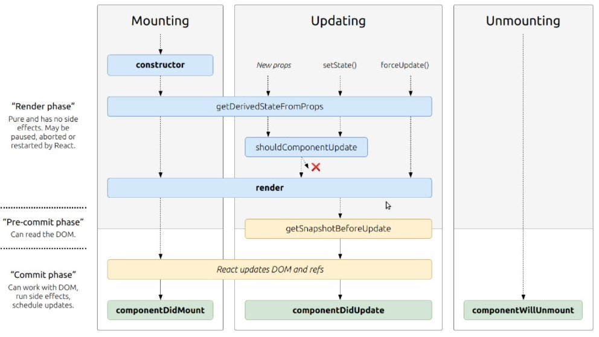

# React: State and Props

* **What are component lifecycle events?**
    - React lets you define components as classes or functions. The methods that you are able to use on these are called lifecycle events. These methods can be called during the lifecycle of a component, and they allow you to update the UI and application states.

* Mounting, Updating, and Unmounting are the three phases of the component lifecycle.
    - **Mounting**
When an instance of a component is being created and inserted into the DOM it occurs during the mounting phase. Constructor, static getDerivedStateFromProps, render, componentDidMount, and UNSAFE_componentWillMount all occur in this order during mounting.
    - **Updating**
Anytime a component is updated or state changes then it is rerendered. These lifecycle events happen during updating in this order.
static getDerivedStateFromProps, shouldComponentUpdate, render,
getSnapshotBeforeUpdate, componentDidUpdate, UNSAFE_componentWillUpdate, UNSAFE_componentWillReceiveProps
    - **Unmounting**
The final phase of the lifecycle if called when a component is being removed from the DOM. componentWillUnmount is the only lifecycle event during this phase.
**[Back to: Homepage](https://omarhumamah.github.io/reading-note/).**