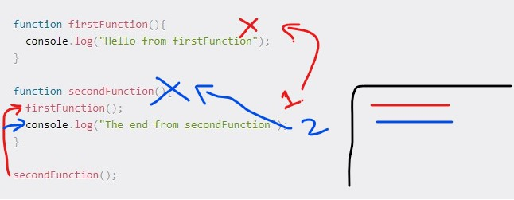

# In memory storage

## Understanding the JavaScript Call Stack

- What is a ‘call’?

  - a call stack is a data structure that uses the Last In, First Out (LIFO) principle to temporarily store and manage function invocation (call).

- How many ‘calls’ can happen at once?

  - code execution in JavaScript synchronous.

- What does LIFO mean?

  - it means that the last function that gets pushed into the stack is the first to be pop out, when the function return.

- Draw an example of a call stack and the functions that would need to be invoked to generate that call stack.
  - 
    - the second function call the first function and remove it out from the memory
    - the it return and print “The end from secondFunction” and clear the memory
- What causes a Stack Overflow?
  - A stack overflow occurs when there is a recursive function (a function that calls itself) without an exit point. The browser (hosting environment) has a maximum stack call that it can accommodate before throwing a stack error.

_[source](https://www.freecodecamp.org/news/understanding-the-javascript-call-stack-861e41ae61d4/)_

## JavaScript error messages

- What is a ‘reference error’?
  - This is as simple as when you try to use a variable that is not yet declared you get this type os errors.
- What is a ‘syntax error’?
  - This occurs when you have something that cannot be parsed in terms of syntax, like when you try to parse an invalid object using JSON.parse.
- What is a ‘range error’?
  - Try to manipulate an object with some kind of length and give it an invalid length and this kind of errors will show up.
- What is a ‘type error’?
  - this types of errors show up when the types (number, string and so on) you are trying to use or access are incompatible, like accessing a property in an undefined type of variable.
- What is a breakpoint? What does the word ‘debugger’ do in your code?
  - The breakpoint can be achieved by putting a debugger statement in your code in the line you want to break. You can also add conditional breakpoints by right-clicking a previous set breakpoint, which will make your program stop at that point only if a condition is met, this is awesome for when you want to debug huge cycles for specific values. In this example the breakpoint will point stop when the index reaches 40.

_[source](https://www.freecodecamp.org/news/understanding-the-javascript-call-stack-861e41ae61d4/)_

**[Back to: Homepage](https://omarhumamah.github.io/reading-note/).**
