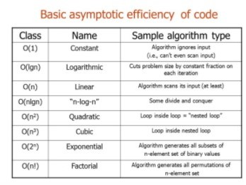

# Linked list

### Big O
- Big O(oh) notation is used to describe the efficiency of an algorithm or function. This efficiency is evaluated based on 2 factors:
     - `Running Time` needed to execute the function.
     - `Memory Space` needed to store the data 

        

---

### Linked list 
- A Linked List is a sequence of Nodes that are connected/linked to each other. The most defining feature of a Linked List is that each Node references the next Node in the link.

-  `Linked List - Singly`: refers to the number of references the node has. A Singly linked list means that there is only one reference, and the reference points to the Next node in a linked list.
-  `Linked List - Doubly`: refers to there being two (double) references within the node. A Doubly linked list means that there is a reference to both the Next and Previous node.
- `Node`:  are the individual items/links that live in a linked list. Each node contains the data for each link.
- `Next`: Each node contains a property called Next. This property contains the reference to the next node.
- `Head`: The Head is a reference of type Node to the first node in a linked list.
- `Current`: The Current is a reference of type Node to the node that is currently being looked at. When traversing, you create a new Current variable at the Head to guarantee you are starting from the beginning of the linked list.

**What does it look like**

> { value: 4, node:{ value: 8, node:{ value: 15, node:{ value:16, node:{value: 32, node: null}, }, },},}

