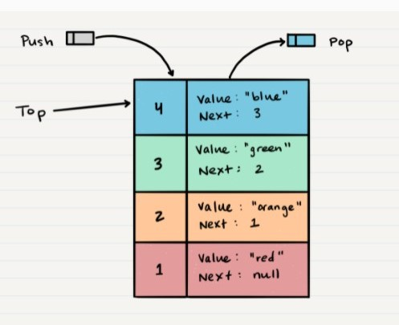
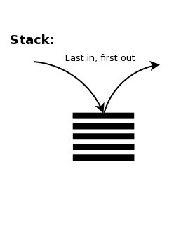
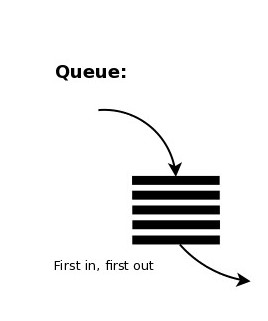

# Stacks and Queues

## What is a Stack
 - A stack is a data structure that consists of Nodes. Each Node references the next Node in the stack, but does not reference its previous.
 - It is like the pancake piece on top of another piece, to reach a piece from the middle you have to remove pieces one by one from the top until you reach the piece you want.

 ### common terms
- `Push`: Nodes or items that are put into the stack are pushed
- `Pop`: Nodes or items that are removed from the stack are popped. When you attempt to pop an empty stack an exception - will be raised.
- `Top`: This is the top of the stack.
- `Peek`: When you peek you will view the value of the top Node in the stack. When you attempt to peek an empty stack an exception will be raised.
- `IsEmpty`: returns true when stack is empty otherwise returns false. 

- **Stacks follow these concepts:**

`FILO`: First In Last Out; This means that the first item added in the stack will be the last item popped out of the stack.

*** 

***

## What is a Queues
- A Queue is a collection of entities that are maintained in a sequence and can be modified by the addition of entities at one end of the sequence and the removal of entities from the other end of the sequence.
- It is like the line front a cinema, the first person in the line will enter and the new person will wait at the last of the line.

### common terms
- `Enqueue`: Nodes or items that are added to the queue.
- `Dequeue`: Nodes or items that are removed from the queue. If called when the queue is empty an exception will be raised.
- `Front`: This is the front/first Node of the queue.
- `Rear`: This is the rear/last Node of the queue.
- `Peek`: When you peek you will view the value of the front Node in the queue. If called when the queue is empty an exception will be raised.
- `IsEmpty`: returns true when queue is empty otherwise returns false.

- **Queues follow these concepts:**

`FIFO`: First In First Out; This means that the first item in the queue will be the first item out of the queue.

*** 

***