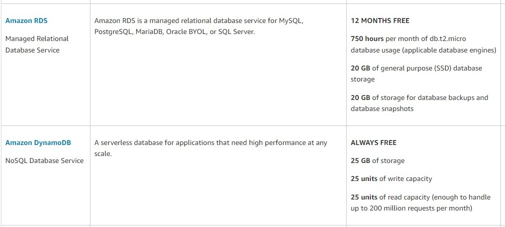
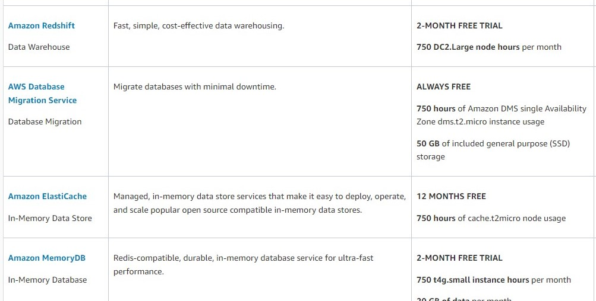

# AWS: Events

## Describe the similarities between AWS API Gateway + Lambda functions and an ExpressJS Server

- they both can use Key Authentication, HTTPS and CORS. Each resource requires its own configuration. If you choose to use custom authorizers, you will need to set up your own database independent of Amazon API Gateway.

## List the AWS Database offerings and talk about the pros and cons of each

- 
- 
- **[source](https://aws.amazon.com/free/database/?trk=ps_a134p000007Cga9AAC&trkCampaign=acq_paid_search_brand&sc_channel=PS&sc_campaign=acquisition_EEM&sc_publisher=Google&sc_category=Database&sc_country=EEM&sc_geo=EMEA&sc_outcome=acq&sc_detail=aws%20database%20services&sc_content=Cloud%20Database_e&sc_matchtype=e&sc_segment=548915588388&sc_medium=ACQ-P|PS-GO|Brand|Desktop|SU|Database|Solution|EEM|EN|Text|xx|Non-EU&s_kwcid=AL!4422!3!548915588388!e!!g!!aws%20database%20services&ef_id=CjwKCAiAv_KMBhAzEiwAs-rX1DwAM5KbM5zA8j1g-uUx8ZGkScSci84-uIcfxU_5PelwEjQgUHL0xRoCZpUQAvD_BwE:G:s&s_kwcid=AL!4422!3!548915588388!e!!g!!aws%20database%20services)**

## What’s the difference between a FIFO and a standard queue?

- Standard queues provide at-least-once delivery, which means that each message is delivered at least once. FIFO queues provide exactly-once processing, which means that each message is delivered once and remains available until a consumer processes it and deletes it.

## How can the server be assured a message was properly received?

- the receiver send a notification to the server that the message is received and emit a function to delete the message from the queue.

---

- `Serverless API`: It is a cloud computing execution model where the cloud provider dynamically manages the allocation and provisioning of servers. A serverless application runs in stateless compute containers that are event-triggered.
- `Triggers`: It is a Lambda resource or a resource in another service that you configure to invoke your function in response to lifecycle events, external requests, or on a schedule.
- `Dynamo vs Mongo`:
  - MongoDB supports read and writes to the same documents and fields in a single database transaction.
  - DynamoDB lacks support for multiple operations within a single transaction.
- `Dynamoose vs Mongoose`:
  - Dynamoose is a modeling tool for Amazon's DynamoDB. Dynamoose is heavily inspired by Mongoose, which means if you are coming from Mongoose the syntax will be very familar.
  - Mongoose provides a straight-forward, schema-based solution to model your application data. It includes built-in type casting, validation, query building, business logic hooks and more, out of the box.

---

## SQS and SNS Basics

- 

## AWS SQS vs SNS 
- SQS and SNS are important components for scalable, large scale, distributed, cloud-based applications:
    - SNS is a distributed publish-subscribe service.
    - SQS is distributed queuing service.
- **Summary**
    - SQS is mainly used to decouple applications. SNS distributes several copies of message to several subscribers. 

[The Full Artical](https://medium.com/awesome-cloud/aws-difference-between-sqs-and-sns-61a397bf76c5)

--- 

