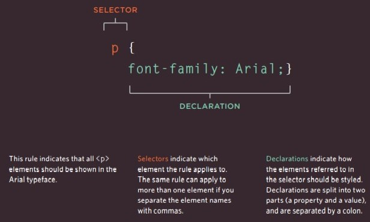
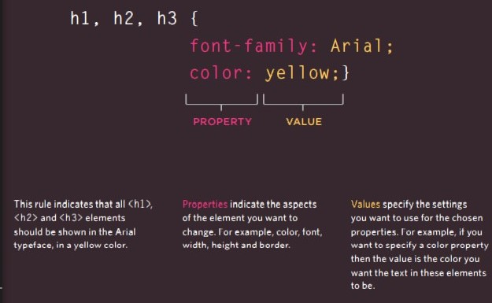
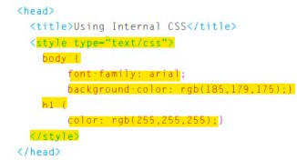
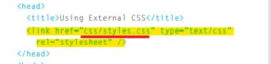
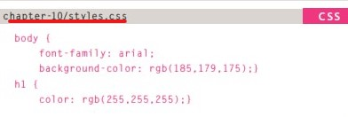
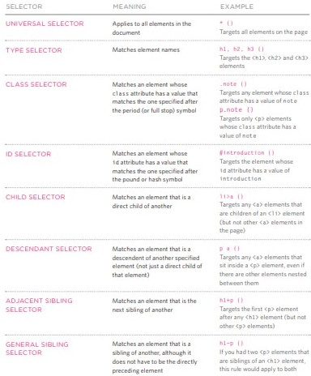
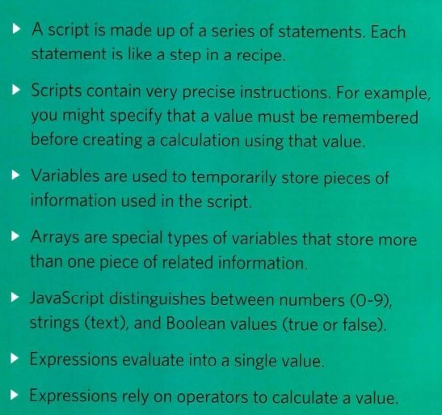
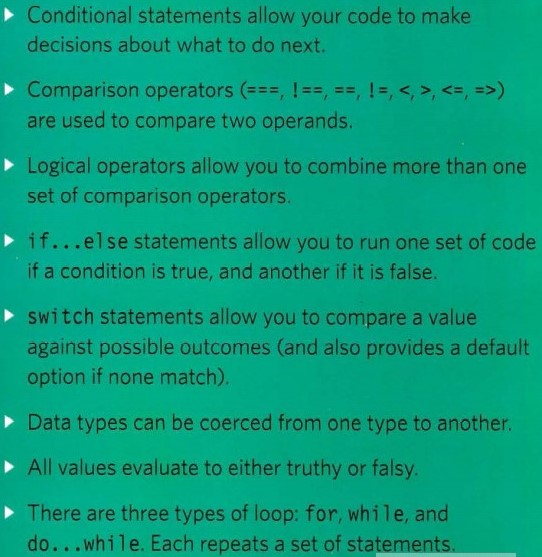

# HTML, CSS and JavaScript
## Text

**Stucture & semantic**
###  Structural markup: 
the elements that you can use to describe both headings and paragraphs.
- Headings
>`<h1>` for heading 

>`<h2>` for subheading
- Paragraphs
>`
` to write a paragraph
- Bold & Italic
>`<b>` make the content style bold

>`<i>` make the content style italic
- Superscript & Subscrip
>`<sup`> contain characters that shoud be like small on top of the line like suffixes

>`` contain characters that shoud be like small under the line like foot notes
- White Space
> if you add extra spaces in html the browser will conseder it as one space
- Line Breaks & Horizontal Rules
> ` ` is self closing elemant which make a new line

>`
`is self closing elemant which make a horizontal line across the page to divide themes

### Semantic markup: 
which provides extra information; such as where emphasis is placed in a sentence.
- Strong & Emphasis
>`<strong>`the words 
contained in this element is stong important, and the browsers will display it in bold by default.

>`<em>` emphasis the meaning of sentence or what it contains,  and the browsers will display it in italic by default. 

- Quotations
>`<blockquote>` it is 
used for longer quotes that take 
up an entire paragraph.

>`<q>` it is used for 
shorter quotes that sit within 
a paragraph, and the browsers will display the content between double qoutation by default. 
- Abbreviations & Acronyms
>`<abbr>` 

- Citations & Definitions
>`<cite>` it is used to referencing a piece of work

>`<dfn>` it is used to 
indicate the defining instance of 
a new term.

- Author Details
>`<address>` it is used to contain contact details for the author of the page.
- Changes to content
>`<ins>`  it is used to show content that has been inserted into a document, and the browsers will display it usually underlined.

> `<del>`  it is used to show text that has been deleted from a document. and the browsers will make it usually has a line through it.

# CSS

## Introducing CSS

* What is CSS?

CSS is a cascading style sheet, allows you to create rules that specify how the content of 
an element should appear.

* How CSS works?

CSS works by associating rules with HTML elements. These rules govern  how the content of specified elements should be displayed. A CSS rule contains two parts: a selector and a declaration.

CSS Properties Affect How Elements Are Displayed

* How to link CSS to HTML?
  - Internal
  You can include CSS rules in HTML page via placeing it inside `<head>` element.
  
  
  - External
  Or you can make page for CSS then link it in HTML page via `<link>` elemnt. 
  >External page is the best practice to style your web page

  
  
   And select element in CSS page to adjust proreities.

   

*  CSS Selectors

There are many different types 
of CSS selector that allow you to 
target rules to specific elements 
in an HTML document. 

# JavaScript
## BASIC JAVASCRIPT INSTRUCTIONS 

>THIS TOPIC IS VERY IMPORTANT YOU SHOULD READ IT FROM THE BOOK CEARFULY *JAVASCRIPT & JQUERY 
Interactive Front-End Web Development* Pp53

## DECISIONS & LOOPS 

>THIS TOPIC IS VERY IMPORTANT YOU SHOULD READ IT FROM THE BOOK CEARFULY *JAVASCRIPT & JQUERY 
Interactive Front-End Web Development* Pp145

**[Back to: Homepage](https://omarhumamah.github.io/reading-note/).**